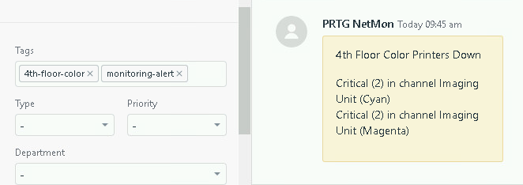

# PRTG Zendesk Tickets Webhook

Automatically open tickets for triggered sensors using Powershell.  Forked from [Integrating Zendesk and PRTG](https://tietze.io/b/2015/09/08/integrating-zendesk-and-prtg/)



Before:
> Error by lookup value

After:
> Error by lookup value Critical (2) in channel Imaging Unit (Magenta)
>
> .. if additional triggers from the same sensor, a newline to easily list the problems

Main Features:
- Automatically open Zendesk tickets when a sensor is triggered; useful for IT Staff to automate delegation to tech assistants
- Update/reopen existing tickets for the same sensor

This version has additional features:
- Tokenized authentication, to keep your password secure
- Fixes the single quote bug when using Powershell
- Local logging option for debugging when testing sensors
- A bit more newb friendly
- Formatting cleanup

This script [solves the single quotes bug](https://kb.paessler.com/en/topic/75261-single-quote-in-sensor-message-breaks-notification-script) PRTG developers won't fix for Powershell EXE Notifications.


## How to use it
- First, clone/copy *ZendestWebhook.ps1* to: `C:\Program Files (x86)\PRTG Network Monitor\Notifications\EXE` (your path may vary if using a different architecture with your PRTG server)
- Open *ZendeskWebhook.ps1* and add your config (Zendesk credentials, log options, etc; use your *API token* as the password)
- Login to your PRTG dashboard
- Setup > Account Settings > Notification Templates
- Add/click on the template you want to use with this script
- Populate the settings as you wish, then scroll toward the bottom for the **Execute Program** toggle; click it
- In the **Program File** field, select `Zendeskwebhook.ps1`
- In the **Parameters** field, add the following:
```powershell
-Device '%device' -Status '%status' -Down '%down' -Group '%group' -commentssensor '%commentssensor' -CommentsProbe '%commentsprobe' -Message ''%message''
```
- In the search field (upper right corner), search for the *sensor Group* you'd like to use this script with
- Under the group list, click it > Notification Triggers > Add/edit the trigger you wish to use with this script and select the notification template you assigned the script to earlier
- Save and trigger a sensor that's using the template to test!

## Customizing
If you'd like to add additional verbiage to your tickets, you can call [additional parameters](https://kb.paessler.com/en/topic/373-what-placeholders-can-i-use-with-prtg) in similar fashion to the existing parameters.

If you prefer to use password authentication with Zendesk instead of token auth, simply remove '/token' from the username.

### License
Tietze's release is unlicensed/public domain; my changes are licensed under GPL2
